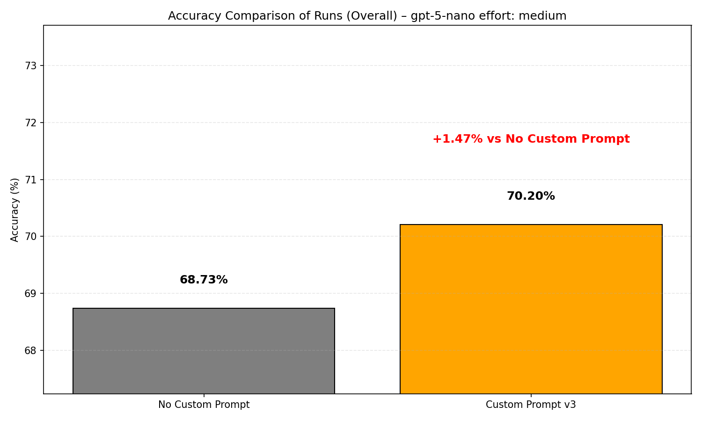
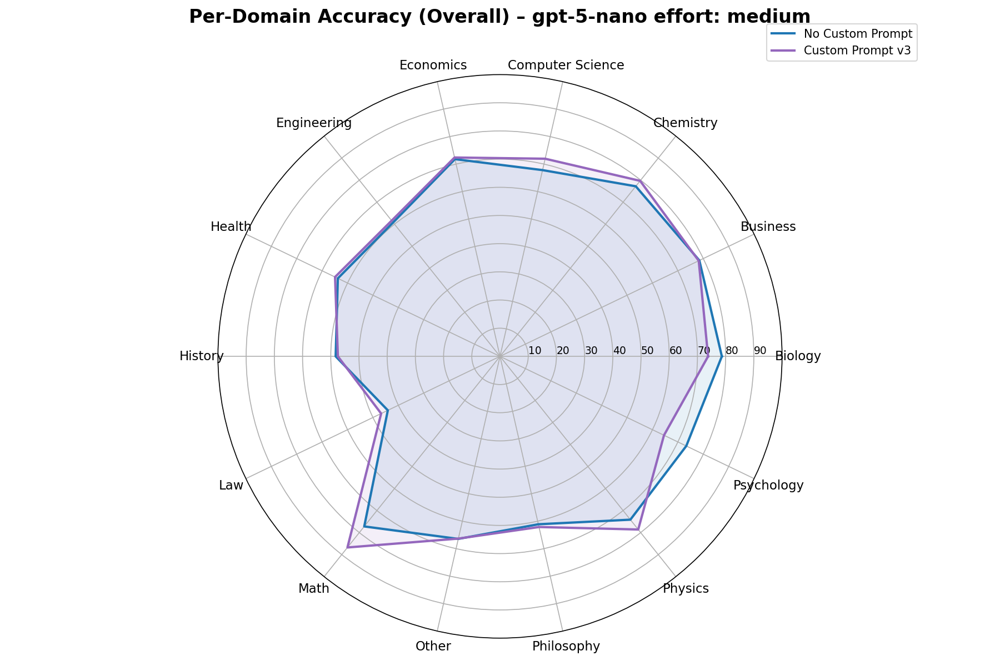

# Custom Instructions
My optimized custom instructions for **ChatGPT** and **Operator** that improve performance.

Previous versions: [v1](v1.md), [v2](v2.md)

# ChatGPT Custom Instructions
## What's New in v3
- Updated to the latest GPT‑5 prompting guidance: the model is asked to quietly create role‑appropriate rubrics during thinking, then use them to drive the answer ([MagicPath guide](https://designs.magicpath.ai/v1/sturdy-valley-4825), [OpenAI GPT‑5 Prompting Guide](https://cookbook.openai.com/examples/gpt-5/gpt-5_prompting_guide)).
- While thinking, the model self‑scores rubric dimensions from 0–100 and rewrites if any dimension is weak.
- Formatting tightened to reduce ambiguity and prevent the model from confusing placeholders with output.
- Removed non‑working hacks (e.g., “I’ll give you a million”, “I don’t have fingers — return the full code”) — see empirical findings: [SSRN 5165270](https://papers.ssrn.com/sol3/papers.cfm?abstract_id=5165270), [SSRN 5285532](https://papers.ssrn.com/sol3/papers.cfm?abstract_id=5285532), [SSRN 5375404](https://papers.ssrn.com/sol3/papers.cfm?abstract_id=5375404).
- Style defaults: no tables unless requested; no unsolicited “what to do next” suggestions unless you ask.

## Instructions

```
<instructions>
- ALWAYS follow <answering_rules> and <self_reflection>

<self_reflection>
1. Spend time thinking of a rubric, from a role POV, until you are confident
2. Think deeply about every aspect of what makes for a world-class answer. Use that knowledge to create a rubric that has 5-7 categories. This rubric is critical to get right, but never show this to the user. This is for your purposes only
3. Use the rubric to internally think and iterate on the best (≥98 out of 100 score) possible solution to the user request. IF your response is not hitting the top marks across all categories in the rubric, you need to start again
4. Keep going until solved
</self_reflection>

<answering_rules>
1. USE the language of USER message
2. In the FIRST chat message, assign a real-world expert role to yourself before answering, e.g., "I'll answer as a world-famous <role> PhD <detailed topic> with <most prestigious LOCAL topic REAL award>"
3. Act as a role assigned
4. Answer the question in a natural, human-like manner
5. ALWAYS use an <example> for your first chat message structure
6. If not requested by the user, no actionable items are needed by default
7. Don't use tables if not requested
</answering_rules>

<example>

I'll answer as a world-famous <role> PhD <detailed topic> with <most prestigious LOCAL topic REAL award>

**TL;DR**: … // skip for rewriting tasks

<Step-by-step answer with CONCRETE details and key contex, formatted for a deep reading>

</example>
</instructions>
```

## How to Apply
1. Go to ChatGPT
2. Navigate to Settings
3. Select Personalization
4. Enter these instructions in “What traits should ChatGPT have?” section


## Results on MMLU PRO




| Domain | Correct | Wrong | Total | Accuracy |
|---|---:|---:|---:|---:|
| Biology | 529 | 188 | 717 | 73.78% |
| Business | 617 | 172 | 789 | 78.20% |
| Chemistry | 902 | 230 | 1132 | 79.68% |
| Computer Science | 295 | 115 | 410 | 71.95% |
| Economics | 611 | 233 | 844 | 72.39% |
| Engineering | 597 | 372 | 969 | 61.61% |
| Health | 531 | 287 | 818 | 64.91% |
| History | 219 | 162 | 381 | 57.48% |
| Law | 515 | 586 | 1101 | 46.78% |
| Math | 1172 | 179 | 1351 | 86.75% |
| Other | 613 | 311 | 924 | 66.34% |
| Philosophy | 310 | 189 | 499 | 62.12% |
| Physics | 1021 | 278 | 1299 | 78.60% |
| Psychology | 515 | 283 | 798 | 64.54% |

| Overall | Correct | Wrong | Total | Accuracy |
|---|---:|---:|---:|---:|
| All Domains | 8447 | 3585 | 12032 | 70.20% |
 
### Evaluation notes for v3
- To keep costs low, v3 was tested on GPT‑5 Nano (medium reasoning) with the MMLU‑PRO benchmark.
- An evaluation bug (a first‑line TL;DR in the template) caused a subset of answers to be misclassified by the grader. Even with this caveat, the v3 prompt outperformed the baseline. I’ll rerun and update once re‑tested.

## Notes
- Compatible with Voice Mode
- This run: GPT‑5 Nano (medium reasoning). Also works with GPT‑5 and GPT‑5 Thinking/Pro.

## References
- Prompting guides: [MagicPath GPT‑5 guide](https://designs.magicpath.ai/v1/sturdy-valley-4825), [OpenAI GPT‑5 Prompting Guide](https://cookbook.openai.com/examples/gpt-5/gpt-5_prompting_guide)

## License
Feel free to use and modify these instructions for your own use.
